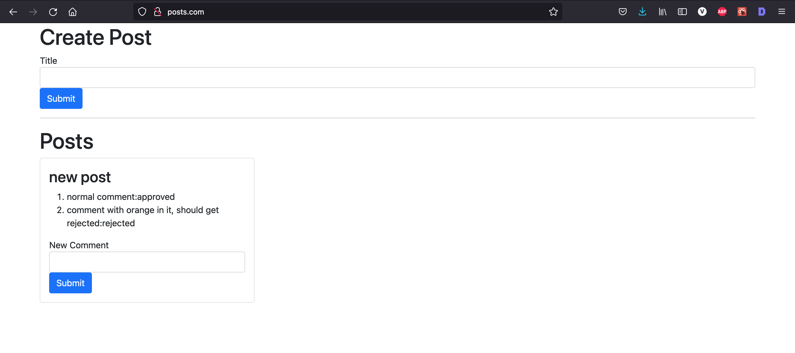
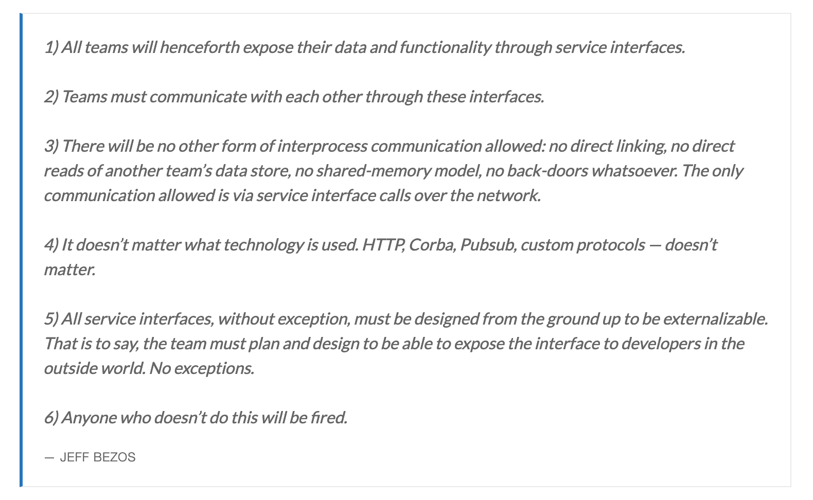

# A mini microservice app from scratch

To run this application:

> run `skaffold dev`

when application starts, go to `posts.com` in your browser.

YOU SHOULD SEE SOMETHING LIKE BELOW:

1. **Note**: you will have to edits your `/etc/hosts` file to point `127.0.0.1` to `posts.com`.
2. **Note**: This also assumes you have docker for destop installed on your machine where you are trying to run this application.
3. **Note**: Ofcourse, you also need to install skaffold cli. For mac do `brew install skaffold`

---

Bezo's wrote this in 2002,

But:

> The reality is that services do need to work together and do sometimes need to share data. How do you do that effectively? How do you ensure that this is done in a way that is sympathetic to your application’s latency and load conditions? What happens when one service needs a lot of information from another

- Different `types of communication` between services: sync vs async

  - In `sync` communication we generally get into `web of service dependency` which overtime kills the reliability of the system.
  - With microservices we use `asynchronous` communication strategies `through the use of events`.

- `Sharing of data` between services

  - **Data duplication**: Data costs are tending to 0 so do not worry about it.
  - **Data consistency**: This can get you into trouble, think hard when designing service boundries.

- Leveraging `events` and custom `event bus` to coordinate business logic

  - Process: `Categorise events` into `domain specific and general` to help define _better business logic centralisation_ and _service boundaries_.
  - Process: How to organise event definition in a central place (as supposed what we currently have where event defintions are spread accross) and always in sync with all services ?
  - Technology: Many different implementations (NATS, Kafka, RabbitMQ etc.) have varitey of different features, evaluate before building/choosing.
  - Event Sync: Use `persistent ordered event data store` to solve for service downtime data in-consistency issues.

## Kubernetes practical notes

- All one has to do is write config files. Can't be that hard.
- We will write config for:

  - Deployments
  - Services: Kubernetes objects to hep with intra pod and outside to cluster communication.
    - ClusterIP
    - NODE Port: used to connect directly to a pod; usually used in dev enviorment
    - Load Balancers
      - `kubectl apply -f https://raw.githubusercontent.com/kubernetes/ingress-nginx/controller-v0.49.0/deploy/static/provider/cloud/deploy.yaml`
    - External Name

- Colocating deployment and service configuration helps. We do this.
- To _update a deployment/service_

  - the deployment must be using the latest tag in the pod spec section
  - Make an update to your code
  - Build the docker image
  - Push the image to docker
  - Run the command: `kubectl rollout restart deployment [depl_name]`

- We use [skaffold](https://skaffold.dev/) to automate a lot of manual steps we do to make our dev expreience more intentfull.

Skaffold is

> A tool that facilitates continuous development for Kubernetes applications.

It does really three things:

- when we start, bring up all the manifests
- When we make a change to our manifests directory, restart the kubernetes objects
- When we are done, delete all the objects
